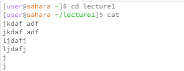

Lab Report Week 1
`cd`  This is a command that changes the working directory. 

When we have no arguments passed in, the working directory was changed to the home directory. The two dots return back to one directory before the current directory. In this case, it went from:

` \home\ lecture1 ` --> ` \home `

With a directory argument, the new working directory was changed to the directory passed as an argument. In this case, it went from:

` \home ` --> ` \home\lecture1 `

When a file path was passed in as an argument, an error message was thrown saying that the file wasn't a directory. The ` cd ` command can only accept directory arguments as that's what's going to be the final directory. Hence, the directories remained: 

`\home\lecture1 `

` ls ` 

This is a command that lists out the items in a directory as a list.

When no arguments are passed in, it returns the items found in the current working directory.

With a directory argument, it returns a list of items in that directory.

With a file path argument, it returns the file path. 

` cat  ` 

This is a command that prints out the contents of a single file. This is time-saving as one doesn't have to open the entire file in a large application and can read the contents still. 

When no arguments are passed, it types the standard input back into the terminal. 

When a directory argument is passed in, it throws an error saying that the argument was a directory. This is because it cannot concatenate and print the items in a directory as it isn't a file.

When a file path is passed in, the contents of the file get printed out on the terminal.
