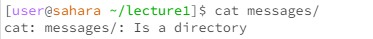

Lab Report Week 1
  ''' cd ''' 
  This is a command that changes the working directory. 
 

 
When we have no arguments passed in, the working directory was changed to the home directory.

 
With a directory argument, the new working directory was changed to the directory passed as an argument.

 
When a file path was passed in as an arguemment, an error message was thrown saying that the file wasn't a directory. The cd command can only accept directory arguments as that's what's going to be the final directory.
  This is a command that lists out the items in a directory as a list.
 

 
When no arguments are passed in, it returns the items found in the current working directory.
 

 
With a directory arguemnt, it returns list of items in that directory.
 

 
With a file path argument, it returns the file path. 
  This is a command that lists out the items in a directory as a list.
 

 
When no arguments are passed, it returns nothing.
 

 
When a directory argument is passed in, it throws an error saying that the argument was a directory. This is because it cannot concatenate and print the items in a directory as it isn't a file.
 

  
When a file path is passed in, the contents of the file get printed out on the terminal.
