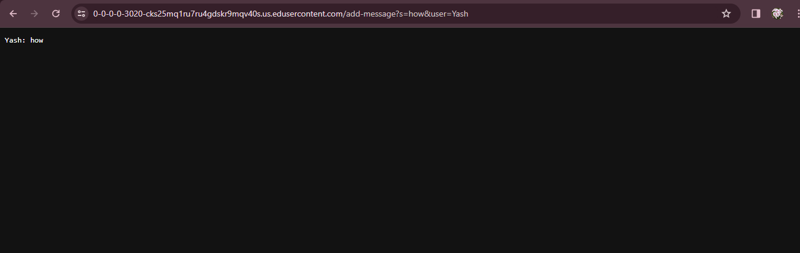
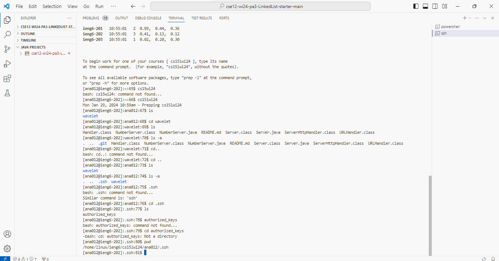
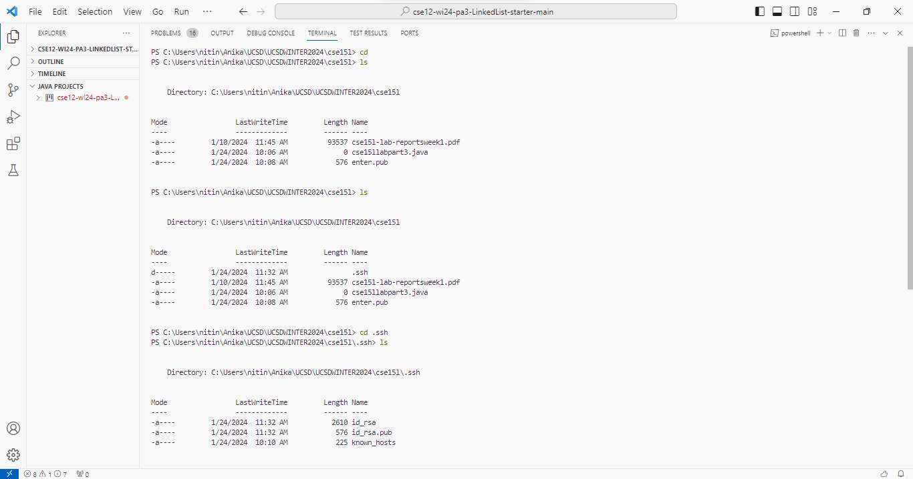
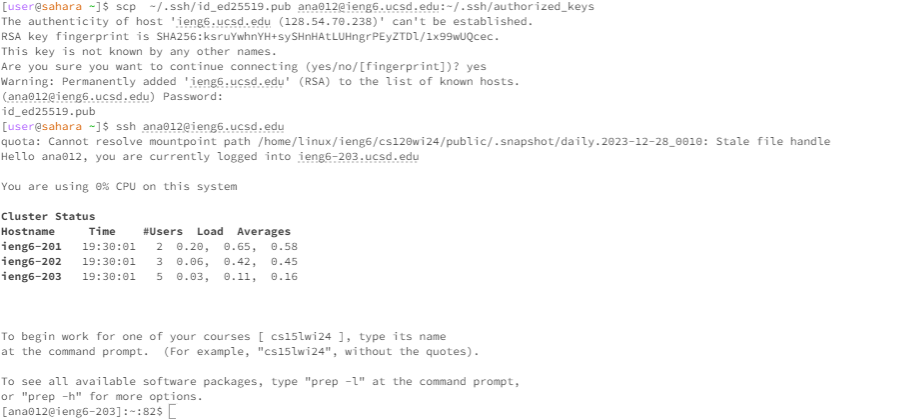

Part 1  
We will be creating a `Chat Server` in this part of the lab. The type of inputs that we expect are as follows:
`/add-message?s=<string>&user=<string>`

In our server, we want the output to like the following:
`<user>: <message>`
The following is the code for `Chat Server`

```
import java.io.IOException;
import java.net.URI;
import java.util.*;


class Handler1 implements URLHandler {
    String messages = "";
    String first, second; 
    public String handleRequest(URI url) {
   
       if (url.getPath().contains("/add-message")) {
            String[] parameters = url.getQuery().split("=");
            String[] sub = parameters[1].split("&user");
            second = sub[0]; 
            first = parameters[2]; 
            messages = messages + first + ": " + second + "\n"; 
            return messages;
           
        }         
        return "404 Not Found!";    
    }
    


}
class ChatServer {
    
    public static void main(String[] args) throws IOException {
      
        if(args.length == 0){
            System.out.println("Missing port number! Try any number between 1024 to 49151");
            return;
        }
        int port = Integer.parseInt(args[0]);
        Server.start(port, new Handler1());
        }    
} 
```

Once we compile and run this code, we opened up a new server called `ChatServer 3020`. 
Running the same path but with different arguments on the server produces different results: 


The methods called in my code are the main method and the handleRequest method. 

`Main Method`:   
The `main method` creates a new server using the port number provided as args[0] in the command line.  
The `main method` takes in the server port number as its main argument. This argument needs to be between `1024 to 49151`.  
Each time the method is run with a new set of argument, a new server at that port is created.  

`handleRequest` Method:  
The `handleRequest method` takes the URL that has been provided as the argument and applies a bunch of inbuilt `.split` method to split the url into parts which can be turned into the desired output. This method only runs if the url path contains `/add-message`.
In this case the arguments are : `/add-message?s=Hello&user=jpolitz` and `/add-message?s=How are you&user=yash`.

I specifically have split the url based on the `=` sign. After that, I split the produced strings into further substrings using `&user` to obtain specific values from the url. In this case, my string values after applying two `.split` methods are `Yash: how`.  
The values that get changed are `String first` and `String second` variables. These get changed each time the method is called. The messages `String` also changes each time the method is called and helps store the history of the text in the `Chat Server`. It prints out the previous text messages as history in the server.  


This screenshot shows us the output after `/add-message?s=how&user=Yash`.   
Arguments:  
`sub [0]` == `how`  
`parameters [2]` == `Yash`  
Values:  
`String first = null` --> `String first = Yash`    
`String second = null` --> `String second = how`    
`String messages = ""` --> `String messages = "Yash: how`.    
Methods Called: Main method, handleRequest  


 
This screenshot shows us the output after `/add-message?s=good&user=Joe`    
Arguments:  
`sub [0]` == `good`  
`parameters [2]` == `Joe`  
Values:  
`String first = Yash` --> `String first = Joe`    
`String second = how` --> `String second = good`    
`String messages = ""` --> `String messages = "Joe: good`.    
Methods Called: Main method, handleRequest  

Part 2    
Private Key


Public Key   


Logging in without password   



Part 3

Something interesting that I learned in this lab was the function of a computer like `ieng6`. For exmaple through public and private keys, we are able to log into a computer that we don't even know where it exists to run things on it. 
1. If there are applications that are only found on that computer, we can access it through our personal computer. 
2. If there is a program that requires high efficiency, we can run it on the faster computer through our personal computer. 
Once the public and private keys are in sync with the computer we want to connect with and our personal computer, there are so many great things we can do!


